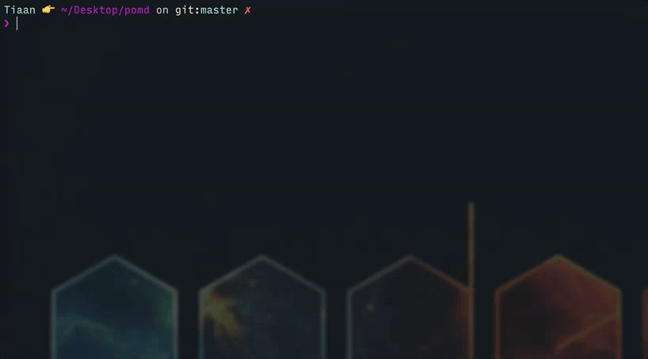

# pomd
[](https://github.com/feross/standard)

🍅 Just a good old cli based pomodoro timer with  native notifactions.

## Install

```
$ npm install -g pomd
```

## Usage

1. Run `pomd` in your terminal.
2. Run `help` to see the options available.

## TODO

- Add ability to run continues sessions.

## Thanks to OSS

pomd is made possible through Open Source Software. A very special thanks to all the modules pomd uses [uses](package.json).

## Contributing
All Contributions are welcome! Please open up an issue if you would like to help out. :smile:

## License
Created with ♥ by [Tiaan du Plessis](https://github.com/mightyCrow). Licensed under the MIT License.

